>   **Technical Whitepaper**

| Version 06-2018                       |
|---------------------------------------|
| The global evidence protection system |
|                                       |

Content
=======

[1 Introduction 4](#introduction)

[2 YOON Architecture (yArch) 5](#yoon-architecture-yarch)

[2.1 CQRS 5](#cqrs)

[2.2 Domain Driven Design 8](#domain-driven-design)

[2.2.1 What is Domain-Driven Design (DDD)? 8](#what-is-domain-driven-design-ddd)

[2.2.2 Why domain driven design? 8](#why-domain-driven-design)

[2.3 Events and Event Sourcing 8](#events-and-event-sourcing)

[2.4 The process manager (Saga) 9](#the-process-manager-saga)

[2.5 The YOON Providers 10](#the-yoon-providers)

[3 YOON Protocol (yProtocol) 11](#yoon-protocol-yprotocol)

[3.2 Commands 12](#commands)

[3.3 Events 13](#events)

[4 YOON API (yAPI) 14](#yoon-api-yapi)

[4.2 OpenAPI 14](#openapi)

[4.3 Identity Provider 15](#identity-provider)

[4.3.2 Bearer access token (JWT) 16](#bearer-access-token-jwt)

[4.3.3 API Key 16](#api-key)

[4.3.4 Security Schema 16](#security-schema)

[4.4 Command API 18](#command-api)

[4.4.2 Command Request Schemas 18](#command-request-schemas)

[4.4.3 Command Paths 20](#command-paths)

[4.5 Query API 20](#query-api)

[4.5.2 Query Response Schemas 20](#query-response-schemas)

[4.5.3 Query Paths 21](#query-paths)

[5 YOON Engine (yEngine) 22](#yoon-engine-yengine)

[5.2 Core 22](#core)

[5.2.2 Use Cases (examples) 22](#use-cases-examples)

[5.2.3 Basic functionality 23](#basic-functionality)

[5.2.4 Extensibility 25](#extensibility)

[6 Yoon DataLayer (yData) 27](#yoon-datalayer-ydata)

[6.2 Data Providers 27](#data-providers)

[6.2.2 Blockchain Provider 27](#blockchain-provider)

[6.2.3 SQL Provider 27](#sql-provider)

[6.2.4 File Storage Provider 27](#file-storage-provider)

[7 YOON Message Bus (yBus) 29](#yoon-message-bus-ybus)

[7.2 Everything is a message 29](#everything-is-a-message)

[7.3 Internal vs. external bus 29](#internal-vs.-external-bus)

[7.4 Queuing messages 29](#queuing-messages)

[7.5 Message Broadcasting Algorithm 29](#message-broadcasting-algorithm)

[7.6 Message Bus Plugins 32](#message-bus-plugins)

[8 YOON Blockchain (yChain) 33](#yoon-blockchain-ychain)

[8.2 Digital Signatures 35](#digital-signatures)

[8.3 Esoteric of Merkle Trees 37](#esoteric-of-merkle-trees)

[8.4 Economic verification algorithm or „Proof of the tasty Steak “
41](#economic-verification-algorithm-or-proof-of-the-tasty-steak)

[8.5 Decentralized File Storage and Anchoring
41](#decentralized-file-storage-and-anchoring)

[8.5 Introducing the YOON peer to peer (in short p2p) model
43](#introducing-the-yoon-peer-to-peer-in-short-p2p-model)

[9. YOON Streaming Services (ySS) 45](#yoon-streaming-services-yss)

[9.1 The Streaming Server 45](#the-streaming-server)

[9.2 Authentication Flow 45](#authentication-flow)

[9.3 Streaming Command and Streaming Via WebSocket
46](#streaming-command-and-streaming-via-websocket)

Introduction
============

The mission of YOON is to overcome the complexity of distributed ledger
technologies providing our customers and our partners a convenient way to
evidence protect their data and intellectual property, by leveraging blockchain
technology.

As the landscape of technologies, especially blockchain based technologies, is
constantly growing and changing, YOON is providing correspondingly scalable
blockchain/data store agnostic, modularizable and extensible product landscapes
based on our basic use cases which can therefore be extended. Also new use cases
defined by our customer needs can be added extending our common business model
for storing and validating evidence-based data.

Purpose of this document shall be the brief technical introduction on how YOON
is implementing the main product-based features as well how our customers can
extend and white-label our services since they want to sell own
products/features based on our services.

As IT Systems are rapidly changing we try also to provide long living product
focused architectures at low cost on scalability and maintainability. We choose
a blockchain agnostic approach due to the fast-evolving nature of blockchain
technologies.

1.  YOON Architecture (yArch)

    1.  CQRS

The base architecture of our systems will be the CQRS –
“Command-Query-Responsibility-Segregation” Pattern.

This pattern divides all operational use cases into a command and a query side.

Whereas the query side only handles application reads, the command side handles
“well commands” only.

With this architecture we mainly want to overcome scalability issues, the
complexity of our business cases and ensure transparency within the whole system
landscape.

Consider following cases:

1.  **When developing within a large global team**, development tasks must be
    split between developers, which can easily be archived when choosing the
    CQRS architecture. Our business developers can work on domain logic leaving
    routine tasks to our technology-oriented developers.

2.  **Sophisticated business logic** - CQRS forces our developers to avoid
    mixing up domain logic and infrastructural operations.

3.  **Scalability** - With CQRS excellent read and write performance as well as
    command handling can be achieved and scaled up on multiple nodes. Since
    queries are read only operations they can be optimized to do fast read
    operations.

As our system includes a wide range of complex subsystems which match in these
patterns, implementing our logic using CQRS will be the most viable choice. In
the layer diagram outlined below you will find a general overview to our
CQRS-based application components.

-   YOONBox: Our company specific SPA frontend providing the visual appearance
    of our services.

-   Other APPs: One could provide their custom frontend.

-   YOON API: Our REST services with a **Command** and a **Query** API and an
    internal message bus.

-   YOON Message Bus: The system wide message bus. Internal message bus and the
    system wide are fully compatible.

-   YOON Core Engine: The YOON core functionality and home of business logic.

-   YOON Plugin Provider: The extensibility component for engine plugin
    development allowing to add additional business requirements based on the
    underlying immutable database technology (including blockchain).

-   YOON Data Layer: The main data management allowing several decentralized and
    centralized database and storage technologies.

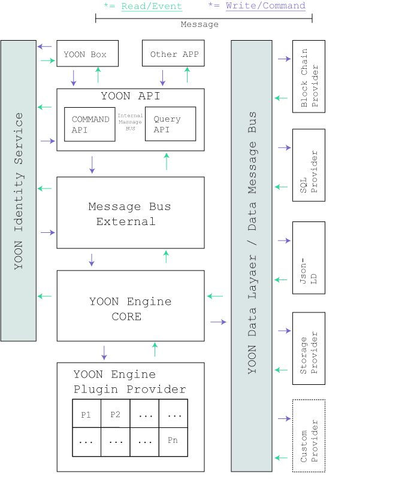

Domain Driven Design
--------------------

### 2.2.1 What is Domain-Driven Design (DDD)?

“Domain-driven design is the expansion upon and application of the domain
concept, as it applies to the development of software. It aims to ease the
creation of complex applications by connecting the related pieces of the
software into an ever-evolving model.”[^1]

[^1]: Initially introduced and made popular by programmer Eric Evans in his 2004
book, *Domain-Driven Design: Tackling Complexity in the Heart of Software* -
<https://airbrake.io/blog/software-design/domain-driven-design>

### Why domain driven design?

As for our implementation within the design pattern CQRS, DDD fits most to
business needs making it transparent implementing business driven domain models
and domains using aggregates for state transitions and entities for reading out
states independently which database/data storage technology we may use in the
future or have been using in the past; meaning they are meant to be
interchangeable, forwards and backwards compatible. An aggregate represents a
bounded context which will handle a specific use case and its state transition
as well spawning business events for further processing.

Events and Event Sourcing 
--------------------------

When talking about **events**, we are exactly talking about a customer that has
used one or more of our services and is expecting a corresponding feedback.
Since we want our customers to be actively informed about their pending
requests, every successful or unsuccessful command will spawn a corresponding
event. And since we want to be backwards and forwards compatible to several
blockchain and non-blockchain based database technologies, as well as storage
providers, we want to be able to migrate to new technologies and business cases
as well. **Event sourcing** will provide a way for auditing and replicating
events based on our needs. Like the name says, event sourcing is the storing and
retrieving of the occurrence of events (in detail state transitions of our
aggregates) for further usage within the YOON architecture.

The process manager (Saga)
--------------------------

On top of supplying and sourcing events YOON needs a way of automating business
processes according to the complexity of our products. The most viable way in
the context of command query responsibility segregation in conjunction with
using domain driven design and event sourcing is to use a process manager, some
call it a saga, for combining our bounded contexts or aggregates to a state
machine like behavior with the possibility of scaling all our components over
more than only one physical system. This diagram shows an example process
manager implementation managing the states via aggregates, where the violet
arrows represents commands/write actions and the green events/read actions. This
image demonstrates the use case of ordering seats e.g. for an airplane.

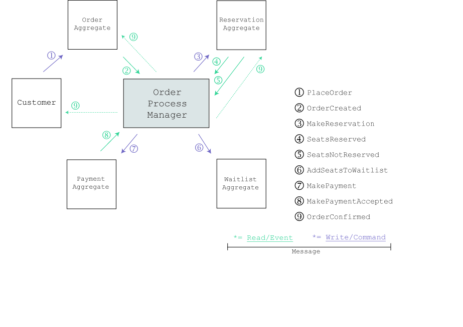

According to this example we must pass through the following steps:

1.  Place an order (more abstract making a request, therefore sending a command)

2.  The order manager creates an event for signaling that the order has been
    created (request accepted)

3.  The order manager tries to book a reservation (inner message bus command)

4.  The reservation aggregate creates an event for the reservation succeeded
    (inner message bus event)

5.  The reservation aggregate creates an event for the reservation not succeeded
    (inner message bus event)

6.  According to the received event reservation succeeded the order manager
    spawns a payment command (the critical command) and a add to waitlist
    command (non-critical).

7.  The payment gets accepted by the payment aggregate spawning a payment
    accepted event. (critical event)

8.  The order manager throws a order created event to the customer (external
    message bus)

Another brief similar example: A user uploads a document and wants his ownership
clarified within our system therefore also claiming ownership.

In practice this action consists out of several actions. Some of it are and some
are not mutually exclusive and usable from other subsystems. The YOON Engine
will be the part were all this information’s (states) from several subsystems
merge and lead to the desired output states the user expects. For instance, a
user could upload a document claiming the ownership but someone else is flagging
this operation as fraudulent operation. So, the engine will be able to manage
each state on each time and be able to rollback previously done operations
sending new **commands** when receiving corresponding **events**. Ultimately the
YOON Engine is the place where our domain logic lies thus our DDD is part of the
architecture outlined above. Read more about the engine, messages, commands and
events in the following chapters.

The YOON Providers
------------------

Yoon providers will be an abstract concept in our application structure for
accessing external technologies like storage systems (web or non-web based,
blockchain or non-blockchain based), RESTful Services or reading out identity
information. As they abstract common use cases they reflect external standards.
On providers you possibly can think on your internet provider or
telecommunication provider. Our providers differ from your provider abstracting
this particular use case, like offering a bandwidth over copper and/or fiber
cable for you enabling your VDSL modem connecting to the internet.

YOON Protocol (yProtocol)
=========================

The YOON Protocol will be the key part of all our systems defining our business
actions as **messages**, **commands** and **events**.

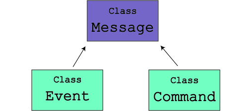

As you can see in the diagram above all our **commands** and **events** are
**messages**. In terms of information systems, a message is a textual
information encoded into a human readable format and simultaneously as a content
for machine to machine communication (e.g. E-Mail, Printer Service Protocol
Messages over the Internet [**IPP**], WhatsApp Messages, or a CAN Bus message in
your car or vehicle indicating your battery is low).

A message is the part of information without a specific action or context. It
could literally be **anything**. An ID, a string, an object or anything else.
Messages have no specific context. What provides a message with more context is
a command or an event.

A **command** is a message indicating that something should or must happen.

An **event** is a message indicating that something already happened.

So, **events** and **commands** are both **time relevant** whereas messages are
not. With the implementation of CQRS commands and events play a significant role
over the whole subsystems as they decouple the “what is happening” from the
“already happened” within in our systems. For example, “upload a picture with
claiming ownership” and “the ownership of an uploaded picture was granted” are
the messages, first the command and second the event, reflecting the use case
“upload picture with ownership”. More precisely there exist 2 commands and 2
events one for upload and one for the ownership, which has to be handled in a
special way. More on this circumstance later in this document.

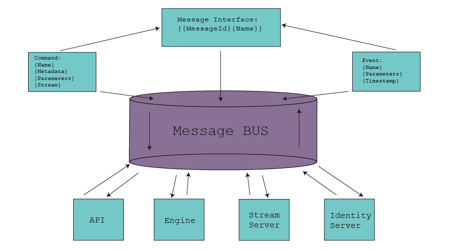

The diagram above illustrates the usage of messages within our message bus
system. Our message bus systems will span across many layers whereas one message
bus is a global service like bus while subsequent internal message bus systems
also exists depending on the implementation in the specific modules.

Commands
--------

In the following table you can see our generic command structure. Commands
therein are structured in the command action, the metadata, parameters and a
stream websocket endpoint for uploading files (a websocket is a HTTP based
protocol on top of the TCP stack allowing persistent http connections).

| Command             | Metadata             | Parameter         | Stream |
|---------------------|----------------------|-------------------|--------|
| Verify              | User information     | Restricted/Public | \-     |
| Upload              | User Info, File Info | Restricted/Public | URI    |
| Flag                | User Information     | Restricted/Public | \-     |
| Delete (restricted) | User Info, File Info | Restricted/Public | \-     |
| Stream              | User Info, File Info | Receiving URI     | \-     |

Events
------

Analogous to our commands the events are describing if any of the above called
actions happened and succeeded. Events occur mostly if a command has been
executed or an external action has been executed within the context of our
business cases, signaling readiness.

| Event          | Metadata                                          | Parameter         | Success     |
|----------------|---------------------------------------------------|-------------------|-------------|
| Verified       | User Info, Timestamp                              | Restricted/Public | True, false |
| Uploaded       | User Info, File Info, Timestamp                   | Restricted/Public | True, false |
| Flagged        | User Info, Timestamp                              | Restricted/Public | True, false |
| Deleted        | User Info, File Info, Timestamp                   | Restricted/Public | True, false |
| AccountCharged | Payment Info e.g. Ethereum or Altcoins, Timestamp | Payment address   | True, false |

YOON API (yAPI)
===============

The YOON API defines our main endpoints for providing the communication between
SPAs or APPs and our services. To obtain industry standard security and
implementation of RESTful web services we were encouraged to find a solution for
defining our API infrastructure dynamically and cross portable between several
programming languages and hosting technologies like Windows Azure, Amazon
Webservices, Apache, Docker etc.

 OpenAPI 
---------

The OpenAPI standard defines a templating language for automate RESTful API
development in several platforms and languages like asp core with .NET, php,
apache with java. Originally developed by swagger, this standard is now licensed
under open source and comes along with a broad community. Meanwhile a
significant number of SDK (Source development kit) providers implemented this
standard, which is one, but not the only, reason why we prefer to use swagger.
It currently seems to be the most viable provider currently. The standard
defines all API endpoints, parameters, bearer access tokens (JWT, OAuth2.0) and
result sets as well as request models.

In general, we will expose a public and a private API. Whereas the private API
is for our internal development, basically all our products and features, the
public API will be the external access point for our partners which can use our
services for developing their own products requiring or implementing our
evidence related services.

The OpenAPI standard defines its components using JSON or YAML. Since JSON is a
subset of YAML it is valid in both scenarios using either YAML or JSON. We will
define our API Components with YAML and compile and store them in JSON. If our
partners prefer to use JSON, they will be fully compatible with our definitions
in advanced scenarios. Below you can see a global example of our parameter
object which will be used by both, command and query side:

parameter:

type: object

name: string

value:

type: object

Identity Provider
-----------------

The identity provider uses the OpenAPI standard and meets industry encryption
standards. We encourage our partners to use our public templates to secure their
evidence-based transactions over RESTful services.

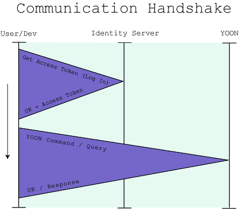

In the diagram above you see a typical communication handshake for authorizing
via our identity service for later accessing the YOON API.

### Bearer access token (JWT)

Our public and private API will be secured by using a bearer access
authentication via the OAUTH2.0. The user, or developer, must login via our
identity service getting a JSON Web Token

### API Key

In addition to bearer access authentication we provide a way to generate and
store API keys for long-term communications via mobile apps or third-party
providers. Like the bearer access token, the API key is bounded to an account.

### Security Schema

For our API Key the security schema looks like this:

components:

...

securitySchemes:

YoonApiKeyAuth:

type: apiKey

description: “API key to authorize requests..”

name: yoonApiKey

in: header

Quite simple, isn’t it? That’s why we use the OpenAPI. We therefore defined our
API Security with the API Key Method and Bearer Access token method.[^2] Now we
define the bearer access token authentication and OAUTH2.0:

[^2]: See <https://swagger.io/docs/specification/authentication/api-keys/> for
more information.

components:

securitySchemes:

…

YoonBearerAuth:

type: http

scheme: bearer

YoonOAuth2:

type: oauth2

flows:

authorizationCode:

authorizationUrl: https://yoon.online/ouath

tokenUrl: https://yoon.online/ouath/token

scopes:

read: Grants read access

write: Grants write access

admin: Grants access to admin operations

Command API 
------------

Our command API will responsible for receiving the commands described above. In
the header there must exist the specified token when using our API. We will
define it at the root level. The definition files are stored in our database and
on initiation the API implantation will be automatically compiled in the
configured output language for clients (SPA) as well for the servers.

### Command Request Schemas

Here is our first command schema:

components:

schemas:

…

Message:

type: object

discriminator:

propertyName: messageType

properties:

name:

type: string

messageType:

type: string

required:

\- name

\- messageType

Command: \#\# "Command" will be used as the discriminator value

description: “A representation of a command.”

allOf:

\- \$ref: '\#/components/schemas/Message'

\- type: object

properties:

metadata:

type: object

description: “The user and file metadata.”

parameters:

type: array

description: “The parameters sent via the command.”

stream:

type: string

description: “The stream URL on which the stream will be pushed over WebSockets
protocol.”

required:

\- metadata

\- parameters

### Command Paths

This will be our first command path definition for our endpoints:

paths:

/commands:

post:

tags:

\- Post a command

summary: "Endpoint for all commands."

description: "A generic endpoint for posting YOON commands."

parameters:

\- \$ref: '\#/components/schemas/Command'

Query API 
----------

Our query API will provide endpoints for accessing data synchronously in an
event-based manner. The events hold all information about what happened with
(needed) meta information about the user himself and the uploaded files.

### Query Response Schemas

Event: \#\# "Event" will be used as the discriminator value

description: A representation of an event. Events will be the endpoints on which
you can also subscribe on this API endpoints with WebSockets.

allOf:

\- \$ref: '\#/components/schemas/Message'

\- type: object

properties:

metadata:

type: object

description: “The user and file metadata”

parameters:

type: array

description: “The parameters sent via the previously sent command.”

success:

type: boolean

description: “Indicates the operation was successful.”

required:

\- metadata

\- parameters

\- success

### Query Paths

paths:

/events:

get:

tags:

\- Gets a list of chronologic ordered events for this account.

summary: "Endpoint for all events."

description: "A generic endpoint for querying YOON events from a specific time."

parameters:

\- name: timestamp:

type: datetime

description: “A timestamp from where we want to receive events.”

\- metadata:

type: object

description: “The events metadata information. Which user? Which file?”

…

 YOON Engine (yEngine)
=========================

The YOON Engine will be the central part of our business logic. As modularized
engine with subscribing on commands and events, outlined above, it does not
expose direct dependencies to other modules in the application.

 Core
-----

The Engine will provide a core with all basic functionalities and will later be
extended to handle more – up to an indefinite number of - use cases. In the next
chapter we will explain some basic concepts we are implementing. You can also
find them on the whitepaper since they directly reflect our core business
concepts.

### Use Cases (examples)

Our use cases all have in common that they reflect the need of evidence
protection, as our major use case, so we want conceptually to extract this case
in one common abstract base.

#### Uploading a file claiming ownership

This is the most common use case and all other use cases will at least partially
derive from this one. For clarity we will describe this process here in detail.

That’s the typical workflow what happens in our application:

1.  A customer logs in (opens the app which retrieves user secrets) and provides
    us with his account information.

2.  (optional) The user can charge his account to have enough credit for to make
    this command.

3.  The customer selects our copyright tool (this is just one tool within our
    toolbox).

4.  The customer chooses a file, from his device, for which he wants to claim
    ownership.

5.  The customer fills in required meta information according to his copyright.

6.  The customer sends the file for which he is claiming copyright.

7.  The engine checks the customer’s account balance. If it meets the required
    balance, the command gets executed, otherwise it fails. Either way, an event
    will be generated indicating if the operation was successful.

To be more precise, two commands (upload, verify) and two events (uploaded,
verified) are generated in a sequence here. If one procedure step fails, the
other fails subsequently and if all succeed, the quite process succeeds so this
will be our first saga here implemented as process manager, e.g. a
**VerifyUploadManager**.

#### Uploading a contractual document with multi party agreement

This case is a derived use case from the case above, with the exception, that
one or more customers meta information is being added. For instance, person
names as contractors and the required actions (commands) which must be executed
on behalf the person(s) could be filled out and then automatically the required
human (or non-human) actors could be informed about the process.

#### Submitting a review together with B2C Handshake

Like the multi-party document agreement (from above), the business to customer
handshake will ensure that the business customer (for example the “hotel”) has
sent a verification command (= “customer checked out”) before the guest account
customer has done his review. We will generate guest accounts on behalf the
reviewers on the fly.

#### Election with automated transparency events

This use case will be a bit more sophisticated since the information, we rely
on, comes from a list of anonymously generated guest accounts (voters), which
will then vote over a site using our endpoints for collecting all necessary
data. After this process the voters get matched with a list of allowed voters
internally, the election process itself is managed by an immutable smart
contract. The match between the list and the vote will be done with an anonymous
hash token, that we created before and then check it again against our internal
database.

#### Upload a testament with events on specific conditions

Like the document or file upload case, outlined in the sub-chapters before, the
testament upload case extends this routine with a more complex ruleset of events
for notifying other customers in case of death. For this procedure we are using
both, our system or an alternative communication channels like e-mail, phone,
pager etc.

### Basic functionality 

Based on our use cases we provide an infrastructure that executes this use cases
mentioned above using a payment models which calculates the current YOON Token
prices for each functionality, as our primary payment method within the whole
YOON ecosystem are YOON Tokens.

#### YOON Accounts

When using our platform, a customer or developer must register at our site and
provide all account information needed like Name, Country, Payment methods
(Ethereum, Stellar, Bank Account) to pass the KYC and to be able to charge his
account with the desired payment method to obtain YOON Tokens. Each
functionality will require a different amount of YOON Tokens, depending on it’s
complexity and computational power. Business partners will be able to obtain API
keys for external development within their account. A YOON account will also be
represented by a Stellar Account and thus fully convertible in both directions.
The Stellar Account in its simplest form is a wallet, from which you can send
and receive YOON Token.

#### Charging and payment methods

As mentioned above YOON accounts are being charged through our charging
mechanisms. We will implement also a mechanism that allows to charge accounts
periodically (abonnement), incentivized by a discount. In the first releases
YOON accounts will be chargeable with Stellar, Ethereum, Bitcoin and Dash. In
further releases we will provide a way to customize the charging process for our
partners using the Stellar Network and providing a way to implement custom
currency charging methods.

#### YOON Token Command Price Model

Depending on the operation there will exist different fees for any of the
corresponding commands (or set of commands). Subscribing to events is generally
free of charge.

In our token model we issue a specific number of tokens.

After the end of our crowdfunding phase we will generate a
[Wei](http://ethdocs.org/en/latest/ether.html)-like representation of our
credits allowing to charge little or no fees for single operations up to larger
fees for chained, more complex operations. For basic operations like the
commands mentioned in the chapter above we charge almost no fees. Almost means
that the fees charged will generate no real-world costs but need a minimum
number of parts of YOON Ticks (inspired by and analogous to processor ticks)
with a scaling factor to be executed. In practice it is a freemium model to
execute the basic commands like “Verify” or “Upload (for small sized files)”.

#### Stellar Payment

The stellar payment will be our channel for tracking YOON Token based
transactions. See
<https://www.stellar.org/developers/horizon/reference/resources/operation.html#payment>
for reference.

#### Stellar YOON Smart Contract

We will generate a Smart Contract storing and managing our business logic
relevant account information replicating it also locally. Stellar Smart
Contracts are represented as a composition or let’s say a series of operations
(transactions, to be more precise) with two or more parties (signatures)
involved. See
<https://www.stellar.org/developers/guides/walkthroughs/stellar-smart-contracts.html>
for more details.

Stellar Smart Contracts are not Turing complete, but they are fully capable or
reflecting our use cases. We will translate Stellar **transactions** into
**commands** and Stellar payment **streams** into **events**, so we will also be
able to represent a Stellar **Smart Contract** as **Stellar Process Manager**.

#### Stellar Payment Command

For making a stellar payment we must translate our commands within an OpenAPI
definition (external data representation) conform representation so that is
understandable for Stellar and vice versa for us as well, when it comes from the
stellar side.

#### Stellar Payment Received Event[^3]

[^3]: The payment received event reflects if a stellar payment with a stellar
wallet was successful.

To react on incoming payments, we will create a corresponding payment event
which will be listened on when a payment will from a customer was received and
thus has the state “received”. Payments in YOON Tokens can be queried by streams
over WebSocket or directly by accessing our API.

### Extensibility

Depending on the underlying blockchain or non-blockchain technology we will
provide a way to extend the YOON Engine with additional plugins. Our developers
can easily add new functionalities for newly designed use cases or new
currencies that we want to accept.

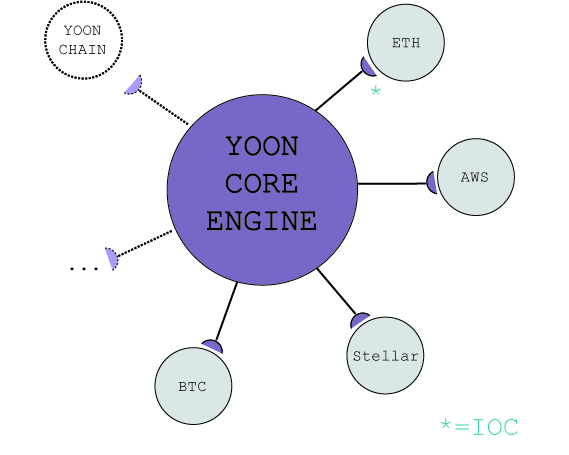

We use dependency injection mechanisms to extend our core engine with additional
modules, so it will be possible to attach or detach additional business logic
depending on the underlying blockchain or non-blockchain immutable database
technology (see diagram above). The modules then will be called subsequently
when needed by a specific event and/or command. For the execution chain and the
dependency injection we will evaluate different IOC (inversion of control)
Containers and choose depending on our business needs.

Yoon DataLayer (yData)
======================

For adopting different blockchain, non-blockchain storages and databases we will
design a repository that can be isolated as service or directly be attached to
our API subscribing either to our external or internal message bus system.

Data Providers 
---------------

The data layer will integrate different providers via dependency injection
mechanisms. Analog to our extensibility of the YOON Engine, the YOON DataLayer
will be extendable the same way subscribing on the corresponding events/commands
the engine enqueues.

### Blockchain Provider

Our main provider for storing data across the application will be the blockchain
providers. This could be internally implemented with different blockchain
technologies like Stellar, Ethereum or EOS. Our first supported platform will be
Stellar. In the immutable ledger domain (also called blockchain) will also
happen the file anchoring in composition with the storage provider.

### SQL Provider

Additional to the blockchain protocol storage we will implement an SQL or NoSQL
provider which mirrors the data for the possibility to migrate all data later
on, when a specific platform mentioned above should die out (which seems to be
very unlikely) or should run into performance problems. The mirroring is also a
measure to keep us independent.

### File Storage Provider

The file storage provider will handle the different file-based storage systems
by abstracting them to a simple form of a folder like file system abstraction
with read, write and execute rights.

####  JSON File Storage (OpenAPI)

We will implement a storage module which handles our OpenAPI definitions like
previously mentioned. Our API is then replicable in different services and
programming languages as well as client endpoint technologies (client SDKs).

#### Decentralized File Storage

Here we will handle our decentralized file storage. We consider first to
implement a solution using **Chainpoint** as anchoring technology for our use
cases, [^4] but the usage of other services leveraging swarm could also be
possible. We will not be enforced to use Chainpoint as the main anchoring
mechanism since file anchoring is a concept or pattern of linking files to
hashes. We will consider using [JSON-LD](https://json-ld.org/) as the main
description language since it is programming language and technology agnostic.

[^4]: Chainpoint is a product of Tierion
([www.tierion.com](http://www.tierion.com)) implementing a service for multiple
blockchains for timestamping and anchoring data within them.

YOON Message Bus (yBus)
=======================

In this section we will describe our YOON Message Bus (yBus), which is intended
to be portable as internal message bus and/or external message bus system. We
consider using a **microservice**[^5] for the external implementation.

[^5]: A microservice is a use case specific application encapsulated as a single
service.

Everything is a message
-----------------------

Since everything in YOON is a message, we can pass through the messages between
all layers and every module, service or API implementation. Messages can be
shared across the whole ecosystem. This implementation is also called message
broadcasting.

Internal vs. external bus
-------------------------

The main difference between an internal and an external message bus will be its
configuration. Every instance of a message can be configured for subscribing on,
publishing and broadcasting different kinds of messages. We will store this kind
of configuration within a database and a local overwritable configuration file.

Queuing messages
----------------

The message bus can enqueue messages if they are not already received from the
subscribing part of the application. A message is received when all subscribing
modules have flagged the messages as received. Modules which have already
received a message ignore this by a message sequence implementation from the
broadcasting algorithm. The message bus will therefore be able to store events
and commands. For example, a **transaction** could be such an event.

Message Broadcasting Algorithm
------------------------------

Like already described, messages are broadcasted over one or more message bus
systems to other subsystems subscribing to events or commands. When speaking in
physical network terms our network communicates asynchronously over a
peer-to-peer network in a physically behavior. When talking in application
terms, the communication spans a complete graph over all applications. Since the
communication with messages over physical and application-based message bus
systems is unified in application, the overall structure of communication is
again peer-to-peer communication, which one could see as subset of a complete
graph in union with a complete graph thus resulting in a complete graph again,
since one or more **processes** could listen on the same message.

The formal definition of the sentence above would be as *G*(*k*) from G where G
is the Complete Graph and *G*(*k*) the kth subset of direct connected network
graphs so within our architecture:

*G*(*k*) ∪ *G* = *G*

We therefore reflect our message bus systems as a complete graph.

Due to reach consistency and order invariance of all messages sent over any type
of media within our or the partner network systems we are forced to implement a
proper broadcasting algorithm. It should be capable of handling all sending and
receiving of messages in a reliable way without the need of a semaphore like
mechanism which may result in blocking other messages to be received properly.
On the next site we will explain how we reach consistency over all application
modules. On the first version of our message broadcasting implementation we
choose a Uniform reliable Broadcast.[^6]

[^6]: See <https://ieeexplore.ieee.org/document/7284349/> for more information.

Like other distributed systems this algorithm uses **consistent one way
hashing** for signing its data to be correct.

The massage broadcast algorithm can easily be converted into a uniform consensus
algorithm, which will later be the heart of our own blockchain, which our
message bus system is a subset from, since we implement a modular approach for
the algorithms as described on the next pages.

Therefore, lets define some basic definitions:

Let {m} be a **message or a set of messages** of any type.

Let {p0} be an independent process which executes asynchronously in relation to
its neighbor processes {p1…, pN}. The processes could also be data nodes N which
have to replicate like this simple formula to reach overall consistency, where
{W} represents a set of writes of **messages** and {R} a set of **reads** of
events:

W + R \> N

This means, if we run **2 processes** respectively nodes, at least **1 message**
and **2 corresponding events** must be replicated.

According to the [CAP Theorem](https://en.wikipedia.org/wiki/CAP_theorem) we
want to ensure at least consistency and availability, so we choose a
**multivalued consensus** for the consistency hashing. The broadcasting
algorithm[^7] we use looks like outlined below:

[^7]: Source
<https://pdfs.semanticscholar.org/9a89/6c6b332b0a37ad4a9c7c099636a23764d68a.pdf>

Definitions for process {pi} ∈ {p1…, pN}.:

{M}, set of known broadcast messages of type {m}, initially empty

{D}, set of delivered messages of type {m}, initially empty

{R}, set of values representing the result of current multivalued consensus
instance

{l}, non-negative integer, initially 0

Code for process {pi}:

**Task 1**: To execute UR-Broadcast({m}):

{M} ← {M} ∪ {m}

**Task 2**: Upon FL-Receive({m}):

M ← {M} ∪ {m}

**Task 3**: Repeat periodically:

for any value v ∈ {M}\\{D}, FL-Send({m}) to all processes

**Task 4**: Repeat periodically:

{R} ← {M}-Con[{l}] ({M}\\{D})

{R} ← {R}\\{D}

UR-Deliver all values in R in some deterministic order

{D} ← {D} ∪ {R}

{l} ← {l} + 1

Message Bus Plugins
-------------------

In the chapter above, we described a modular approach to broadcast messages and
reach consistency over all application modules which means reliable overall
consistency over all stored data, which are also stored as messages. In this
chapter we want to describe the further plugin development for the message bus
implementation.

When the YOON Platform evolves we will transform the **multivalued consensus**
algorithm into a **uniform multivalued consensus**, which means that we can
properly reflect a blockchain friendly consistency mechanism. In the next step
we will create a message bus plugin, which is listening on the messages
according to the storage relevant commands like file anchoring or signing
concrete transactions which will then facilitate our own blockchain.

YOON Blockchain (yChain)
========================

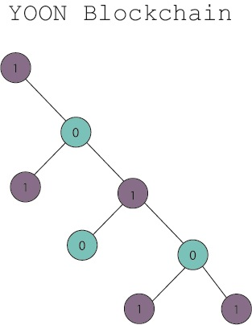

Like many other blockchain technologies we consider modelling our structure of
our hash signing with the help of the well-known [Merkle
Tree](https://en.wikipedia.org/wiki/Merkle_tree)[^8]. As traversal algorithm for
finding the next authentication node we consider using the TREEHASH
algorithm[^9], more specifically a binary tree. (see Picture above) But for more
complex scenarios we consider defining a Merkle Tree of higher order then 2. For
the key pair generation and for signing transactions, we consider using the hash
function **Blake2**[^10], since it is faster than SHA-3 (Keccak) but also
remarkably strong in terms of resisting pre-image attacks[^11] and collision
detection[^12].

[^8]: A Merkle Tree represents a uniform graph with nodes and leafs, which
identities have been encrypted by an arbitrary hash function. A good hash
function should be easy (fast) to compute, but hard to solve (hard to find
collisions and valid pre-images). A full path of a Merkle Tree represented by
leafs and nodes can only be reconstructed in its raw form with the originating
signing message or key. The key gets encrypted by the corresponding hash
function(s).

[^9]: The TREEHASH algorithm we propose is a well know technique to traverse a
sub Merkle tree of interest while ignoring the rest of the tree already
processed.

[^10]: Blake2 is a new encryption standard which was proposed 2012 at NIST -\>
<https://blake2.net/>

[^11]: https://en.wikipedia.org/wiki/Preimage_attack

[^12]: https://en.wikipedia.org/wiki/Collision_resistance

On the next pages we will describe how we could solve this a problem in the
binary tree domain. Therefore, we will define and explain some basic concepts of
tree traversing within a hash binary tree and Merkle Tree signing of messages
and compare them with classical concepts. One could say that blockchain
technologies at a top level consists of two mechanisms, first the one-way hash
function for each new state of the entire blockchain data to ensure the state of
the new block is valid and secondly a public-private key pair of a one-way hash
function which gets randomly generated more than once for an account,
transaction, event, message or whatever to create a signature. We will discuss
effective Merkle Tree traversal techniques, validation of blocks for file
anchoring and the keypair generation of old and the new Merkle signature
generation.

Digital Signatures
------------------

We use digital signatures to proof the validity of files as well as the
authentication of one users. The signatures get generated and to be verified by
one or more trusted parties. The most common signature in the web are
certificate signed SSL connections in your web browser. If a trusted party is
the owner of the actual (signed) connection, the signature is verified while the
asynchronous encryption handshake gets initiated. You as User can verify this by
checking the green lock in your browsers address bar. This kind of verification
process is very similar in other cryptographic enhanced technologies like the
blockchain technology.

1976 the Lamport Diffie [^13] one-time signature method was founded, which use a
one-time hash function

[^13]: Founded by Leslie Lamport, Whitfield Diffie. Ralph Merkle was later the
cofounder of the Diffie Hellman encryption

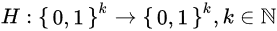

[^14]

[^14]: <https://en.wikipedia.org/wiki/Lamport_signature>

to generate a public key out of a private key. It has the form

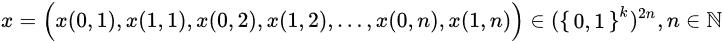

for the normal distributed private key string and

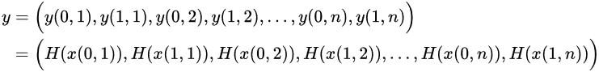

for the encrypted public key string.

For clarity consider following scenario:

Our hash function

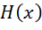

is a simple XOR function so that in binary format

1 XOR 1 is 0,

0 XOR 0 is 0

and 1 XOR 0 is 1.

Like in the formula above Alice encodes a 1 in a 2n + 1 (odd) and a 0 in a 2n
(even) index.

Now Alice wants to send Bob a Message

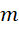

= {0101} with the private key

= {10110010} and the public key

= {01001101} with XOR 1 and is therefore signing the message with

= {1100} and writes this with several other possible variants of a new private
key and public key pair mentioned above. Its only important that its different
from all the others. Bob randomly picks this one and knows the encryption method

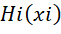

=

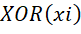

. Since there are existing many solutions, which hit XOR to be valid some could
only guess a possibly wrong combination. Now let’s assume that Bob has received
Alice signed message and can proof the signature by applying her public key with
the signed message and can forge the message by

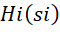

= {01001101} with EVEN/ODD index {1100} and so receives {1010}, and {1010] XOR 1
is {0101}. Eureka! There exist many improvements to this methodology like for
example the Winternitz improvement[^15], but they all have in common one major
problem as you already can guess, the **length** (in size of data) of the
private key. Considering the length of the example above much longer, then all
verifiers of this public key which results in an immerse overhead of computation
and space requirement when you see it as distributed system where one actor
waits until the other has finished verifying. As described earlier we will use
the blake2 hash function for signature generation. [^16]

[^15]: <https://github.com/shelby3/winternitz/blob/master/Winternitz.md>

[^16]: <https://www.cdc.informatik.tu-darmstadt.de/reports/reports/Boris_Ederov.bachelor.Merkle-Tree-Traversal-Techniques.pdf>

Esoteric of Merkle Trees
------------------------

As you may already guess there exists a solution to this problem, founded by
Ralph Merkle[^17], which is and was indeed a revolutionary idea but nothing new,
since it is already popular in use within the Bitcoin blockchain. In the context
of blockchain technology an also revolutionary idea firstly used to describe a
rich state by Vitali Butkerin[^18] the **Merkle Tree** is seen in a new light
from this time. Let’s take a closer look to a simple Merkle (binary) Tree.

[^17]: <https://de.wikipedia.org/wiki/Ralph_Merkle>

[^18]: <https://en.wikipedia.org/wiki/Vitalik_Buterin>

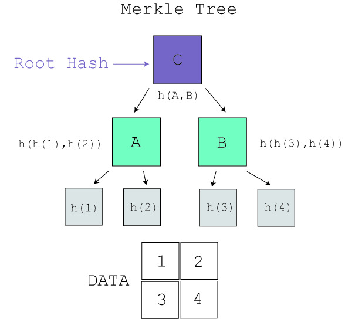

The principle is like the signature generation described on the previous page
with one major advantage: One could verify more than one public key with only
the root hash or fragments within the tree. To be more precise the bottom
elements are the **leaves** or the tree and represents the hashed data. The
middle part of the tree are the nodes and represents the combined hashes of two
**nodes** which labels two hashed **leaves** and so on. The top level is called
**root** hash and represents the generalized public key or let’s say signature
of overall transactions, data, accounts. For instance, one would only need node
A to verify, that h (1) and h (2) are valid signatures of the corresponding data
1 and 2 and not the quite tree.

It has the general and simple formula

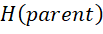

=

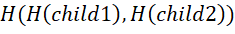

which states, that the next closest parent signs the two children’s. Remember
the private public key signature scheme explained above, the principle is the
very same. Consider the example above as a fraction of a full Merkle Tree for an
atomic transaction chain or for more inter-blockchain states of a YOON Account.
The formula above is used with the blake2 hash function in three phases, key
**generation**, output or let’s say **traversal** and **verification**. We only
describe key generation and traversal, since the verification is just the
application of the formula mentioned above.

Since it is a binary tree the fractal subtree height computes logarithmic with
the formula

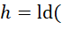

n + 1) where n is the total number of leaves and nodes. So, for instance our
Merkle Tree example above has a height of

7 + 1) = 3, since 2 (h (1), h (2)) \* 2 (h (3), h (4)) \* 2 (A, B) = 8. The root
is excluded or added synthetically since it base is 2\^0 = 1.

Then for key (leaf, node) generation the following algorithm gets applied:

**Key Generation and Setup**

| **1**  | **Initial Subtrees:** For each *i* ∈ {1, 2, ..., *L*}: |
|--------|--------------------------------------------------------|

-   Calculate all non – root nodes n in existing subtree at each logarithmic
    level *i with hash function H(n) where H = blake2*.

    -   Create a new desired subtree which is empty at each level *i* (except
        for *i*= *L*), with leaf position initialized to 2*ih.*

| **2**  | **Public Key:** Calculate and publish tree root. |   |   |
|--------|--------------------------------------------------|---|---|

Where L is the logarithmic count of the subtree levels.

For traversal of the fractal tree following algorithm gets applied, where Desire
is a desired fractal tree and Exist is an existing fractal tree:

**Fractal Merkle Tree Traversal**

| **1**  | Set *leaf* =0.                                                                                                                                                                      |
|--------|-------------------------------------------------------------------------------------------------------------------------------------------------------------------------------------|
| **2**  | **Output:** Authentication path for leaf with index *leaf.*                                                                                                                         |
| **3**  | **Next Subtree:** For each *i* for which Exist is no longer needed, i.e. *i* ∈ {1, 2, ..., *L*−1} such that *leaf* = 2*hi* - 1 mod (2*hi* ) :                                       |
| **4**  | **Grow Subtrees:** For each *I* ∈ {1, 2, ..., *L*−1}: Grow tree *Desirei* by applying two units to *TREEHASH* (unless *Desirei* is completed) starting from leaf with index 2*ih* . |
| **5**  | Increment *leaf* and loop back to step 2 (while *leaf* \< 2*H* - 1).                                                                                                                |

-   Remove root nodes in Exist*i* .

-   Rename tree Desire*i* as tree Exist*i.*

-   Create a new, empty tree *Desirei* (if *leaf* + 2*hi* \< 2*H*).

With the TREEHASH algorithm

**TREEHASH (s, hmax, i, Desire[][])**

| **1**  | Set *leaf* = *s* and create empty stack.                       |
|--------|----------------------------------------------------------------|
| **2**  | **Consolidate:** If top 2 nodes on the stack are equal height: |
| **3**  | **New Leaf:** Otherwise:                                       |
| **4**  | **Push relevant nodes in Desire**: continue:                   |

-   Pop node value

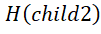

>   from stack.

-   Pop node value

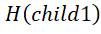

>   from stack.

-   If

>   =

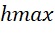

>   – 1, output

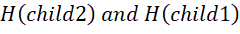

>   and **terminate**.

-   Compute new

>   =

-   If height

>   =

>   then output

-   Push

>   in to the stack and stop.

-   Compute new leaf with hash function

>   .

-   Push

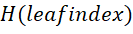

>   onto the stack.

-   Increment *leaf*.

-   For each node value in stack

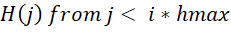

,  
push {stack[s+ i-2],stack[s+i-1].stack[s+i]} in Desire[s][i].

-   Loop to step 2. [^19]

[^19]: <https://www.cdc.informatik.tu-darmstadt.de/reports/reports/Boris_Ederov.bachelor.Merkle-Tree-Traversal-Techniques.pdf>

Remember this is also a one-way hash function? Alice claims the ownership of h
(2) with her public key thus sending Bob h (4) only her minimum authentication
path with different variants of the Merkle Tree structure and says Bob after
generation: Look at {h (1) and h (h (3) + h (4))}. Since Bob is aware of his own
and his parent and his neighbor, he would concatenate his h (h (3) + h (4))
result with given h (h (1) + h (2)) and check if it matches the root value.

We at YOON want to generalize this pattern again and want to sign different
blockchain bound **transactions**, **accounts**, **files** and so on in a single
round trip with different kinds of Merkle Trees, one for each blockchain
technology, like **Stellar**, **Ethereum**, **Bitcoin** etc.

Economic verification algorithm or „Proof of the tasty Steak “ 
---------------------------------------------------------------

Like many other providers for our verification on top of the Merkle Signatures
we consider implementing a Proof of Stake-like algorithm which should be
suitable enough for our business needs. Since it is more an economy related
conceptual algorithm (and is quite far too complex to explain it here within 3
sites), we won’t go deeper in that here. Let’s state that everyone participating
at the YOON Blockchain will receive a first positive stake, so that the “there
is nothing to stake” argument won’t quite fit, but we will implement a malus for
each malicious and/or suspicious action (which later results in a malicious one)
resulting in an event which leaves unvalidated/corrupt blocks of data once
submitted to validate. So, we also talk about (signature) validators, not block
miners. There exist also plenty of (economic) attack scenarios, like the 51%
attack, we will consider choosing one of the known algorithms.

For more information see
<https://blog.ethereum.org/2014/01/15/slasher-a-punitive-proof-of-stake-algorithm/>.

Decentralized File Storage and Anchoring
----------------------------------------

The YOON Blockchain will be able to address and sign big data across different
storage systems, like cloud storage, our local storage or any arbitrary
traditionally file-based storage systems. In the first run we will use
Chainpoint as external data anchoring provider being able to anchor large files
with Merkle Tree signatures at the root level for different files. In the
previous section of this white paper we talked about JSON-LD as markup language
for generic blockchain agnostic anchoring. In this section we will give a brief
example how we use this technology in conjunction with our blockchain or let’s
say Merkle Tree abstraction.

In this example we will use Ethereum Swarm as decentralized file storage
technology. We define the following JSON-LD file:

{

>   "\@context": "{EthereumSwarmSchema}",

>   "\@id": "{DataId}",

>   "name": "{DataName}",

>   "type": "{DataType}",

>   "Created": "{Date}",

>   "YoonAccount" : {PublicKey} (owner),

>   "MerkleRoot": "{RootHash}"

}

In this simple example we demonstrate a generic file, which will be mapped to
Ethereum swarm with data type, name and a global unique id. The bridge between
our blockchain and underlying technology happens with their and our Merkle Root
or let’s say Merkle Root fragment.

In the next step we want to build our own distributed file system with a
classical peer-to-peer network approach allowing third party providers to host a
peer node for distributing and signing files backed by our blockchain client.
Like other blockchain based peer-to-peer networking models we want to apply a
reward system for the participants getting them YOON Tokens for transmitting
data fragments, signing file-based transactions and flagging suspicious actions
on the network.

 8.5 Introducing the YOON peer to peer (in short p2p) model 
---------------------------------------------------------------

The early ages of peer to peer networking are already known by a broad mass as
the popular bit torrent clients which already have made use of distributed hash
tables (in short DHT) [^20], for example eDonkey which represents one of these
distributed file sharing systems. As a peer node you offered your computational
power as well as your bandwidth for allowing others to share **hashed** file
artifacts through your peer node and allows yourself to import seeds to download
a specific file at whole (if you paid sufficient funds in YOON). Our
peer-to-peer model will be a pure p2p model, in which we also serve with some
strong nodes offering you the computational power for the daily use. As a
contributor you can earn YOON Tokens as a reward for hosting a node. You will be
paid for uptime as well as for your bandwidth throughput, proper consistency
checks with Merkle Signatures for the corresponding artifacts (top root hash in
the JSON-LD document) and name resolves for querying new nodes. For clarity
consider following scenario. A YOON Account owner wants to upload a file, an
image for instance, which has a size of 10 Mbytes. Now your image gets split
into 10 even sized chunks (if it were 11 Mbytes big, there would be 11 chunks
with the last one having 1Mb). First, a JSON-LD file gets generated with the
following information:

[^20]: Distributed hash tables are hash tables like on a local node or network
but distributed over one or more peers. A peer could therefore be a client,
server or a service hosted by a cloud provider. Hash tables are data structures,
which provider fast indexing and verification of data and can be linked by
cascading hashes.

{

>   "\@context": "{YoonP2PSchema}",

>   "\@id": "{ImageId}",

>   "name": "{ImageName}",

>   "type": "jpeg",

>   "size": "10Mb",

>   "Created": "{TodayDate}",

>   "YoonAccount" : {PublicKey} (owner),

>   "MerkleRoot": "{RootHash}"

}

Additionally, the owner wants to claim the ownership according to our business
use case No. 1 “Uploading a file claiming the ownership”. First, a series of
identifying immutable transactions will be generated in an inter-blockchain
scenario. For the image fragments a Merkle signature with root hash will be
generated and each chunk will be signed by the corresponding Merkle Tree leaf.
Then the root hash becomes an anchor for the corresponding data like you have
seen in the JSON-LD document.

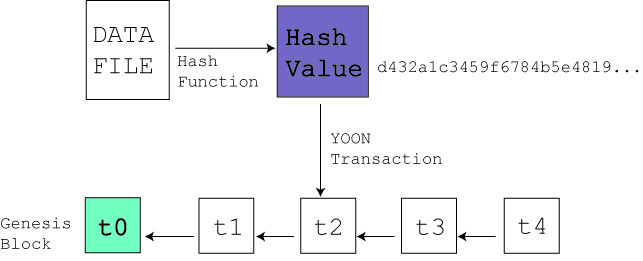

In the next step the file chunks will be distributed with their corresponding
Merkle Signatures and gets converted in a distributed hash table form, like
{Key1, Data1}, {Key2, Data2}, {Key3, Data3} … {Keyn, Datan}.

 9 YOON Streaming Services (ySS)
===================================

With the Yoon Streaming Services, we want to provider a way to open a stream
from one of file providers mentioned above to stream large files over web-based
technologies like state of the art browsers like Google Chrome on Windows as
well as lightweight smart phone browser within iOS or Android operating systems.

The Streaming Server
--------------------

The core concept of our streaming will be a standalone streaming server which
registers on our message bus systems. Once registered the server can listen to
corresponding stream control commands as well to events signaling file-based
operations on our blockchain bound file system abstractions.

Authentication Flow
-------------------

The authentication flow works transparently according to our OpenAPI standard
mentioned above. Once authenticated a web client (single page application) or
any other app can use our streaming API commands.

Streaming Command and Streaming Via WebSocket
---------------------------------------------

For streaming we will use WebSocket[^21] for the transport of our streaming data
and the normal OpenAPI standard for abstracting (file)stream control commands.
For a concrete implementation in PHP in the first version we consider using
Ratched as library for the server part. [^22] The most WebSocket implementations
naturally support messages, events and commands within their implementation as
well as the most JavaScript SPA frameworks implement a publish subscriber
pattern on top of a JavaScript web socket API.

[^21]: <https://tools.ietf.org/html/rfc6455>

[^22]: <http://socketo.me/>

In the diagram underneath we will explain a sample scenario how we would
implement a typical use of WebSocket for our streaming.

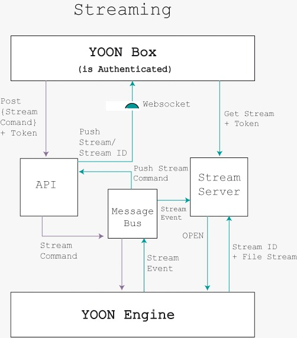

First, a single page application (authenticated), in this case our own YOON Box
pushes a stream command and an authentication token to our API. For further
processing the client opens a web socket to our web socket hub implementation
with the API. In the next step our API internally generates a stream command for
our streaming use case and generates a corresponding stream ID sending it to the
client via web sockets. The API pushes the generates a stream command into to
the message bus. The stream command gets received by our YOON Engine, which
generates a corresponding saga to our business-related use case. If the saga
succeeds, a stream event is generated and pushed to the message bus. The stream
server listens on the stream event and once received it opens the stream by our
file system abstracting data layer. The stream could come from everywhere, e.g.
from Swarm, our P2P network or even amazon web services. The streaming server
generates a push stream command and opens a WebSocket Hub exclusively for the
client with a hash-based URL out of the client’s token and the stream id and
pushes the command to the message bus with the previously generated stream id
and token. The WebSocket Hub within the API receives this command and informs
the client the stream being ready. The client initiates a new WebSocket
connection to the streaming server with the supplied stream id and the token.

References

<https://en.wikipedia.org/wiki/Collision_resistance>

<https://en.wikipedia.org/wiki/Lamport_signature>

<https://en.wikipedia.org/wiki/PreimageAttack>

[www.tierion.com](http://www.tierion.com)

[www.stellar.org](http://www.stellar.org)

<https://github.com/shelby3/winternitz/blob/master/Winternitz.md>

<https://airbrake.io/blog/software-design/domain-driven-design>

Bachelor Thesis, Boris Ederov, Merkle Tree traversal techniques

<https://blake2.net/>

<https://blog.ethereum.org>

*Robter C. Martin, Clean Architecture*

<http://socketo.me/>
